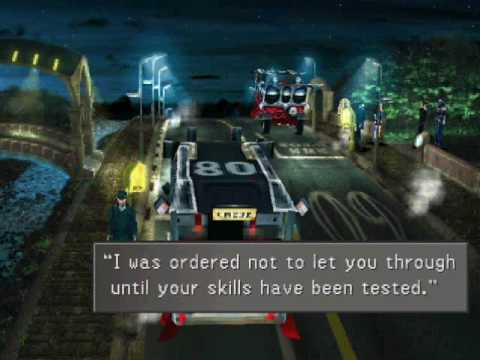

# Julia (FF8 Caraway Code)

*Important note:* This tool is not legal for use during a FF8 speed run. It's intention is to help with routing/casual gameplay/practice where you don't want to count poles every time.

Reads a specific memory address from FF8_EN or FF8_FR (Steam 2013 / non-remaster) that contains the code to get into Caraway's mansion.

# Download
Head over to the [Releases page](https://github.com/brofar/ff8-julia/releases) to download latest release.

## Notes
* The code may change as you move between screens, but will be the correct code when you're in the screen with the guard who asks for it.